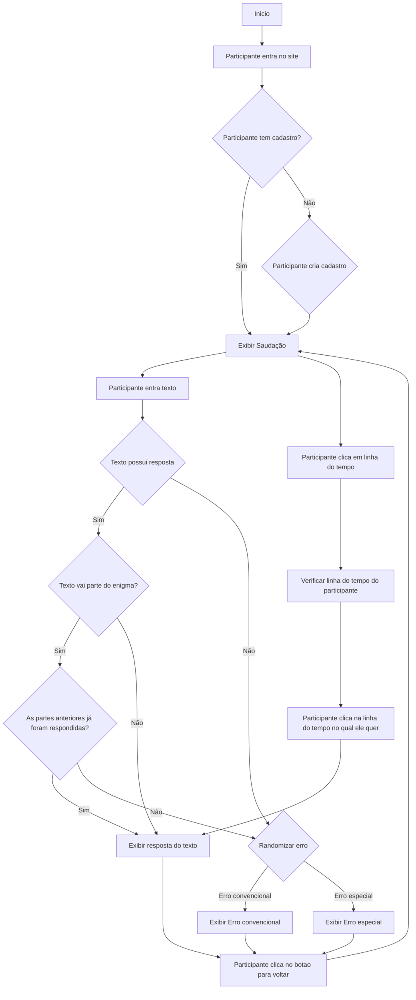

Esse é um projeto para gerenciar um ARG (alternate reality game) pessoal

## Começando...

Primeiramente, para executar o servidor:

```bash
npm run dev
# or
yarn dev
# or
pnpm dev
# or
bun dev
```

Abra [http://localhost:3000](http://localhost:3000) com o browser.

Esse projeto também foi Deployed na Vercel, para acessar use o endereço https://arg-blond.vercel.app ou https://arg-marlusclaytons-projects.vercel.app

## Diagrama de Fluxo
